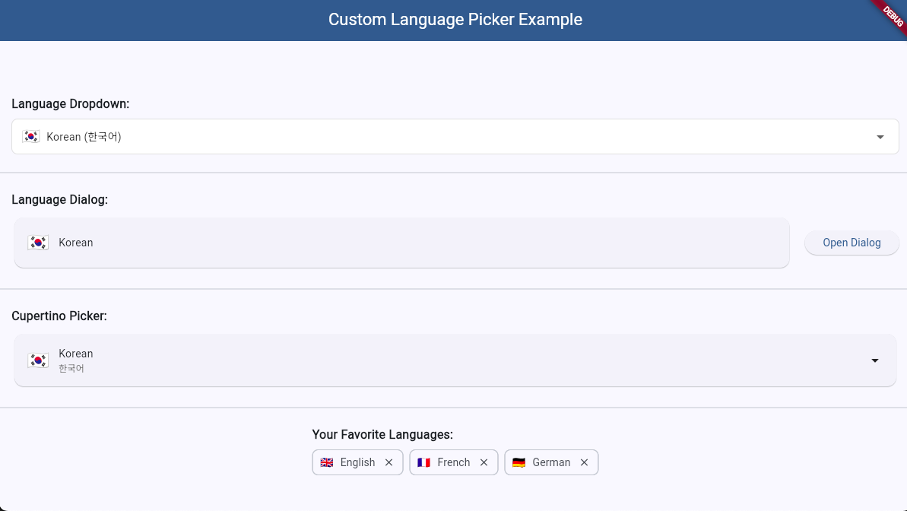
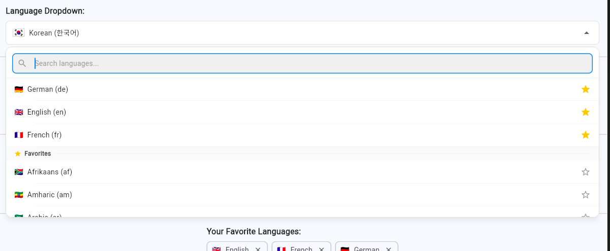
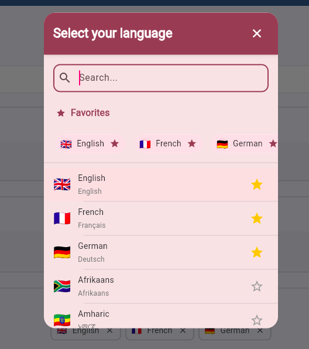
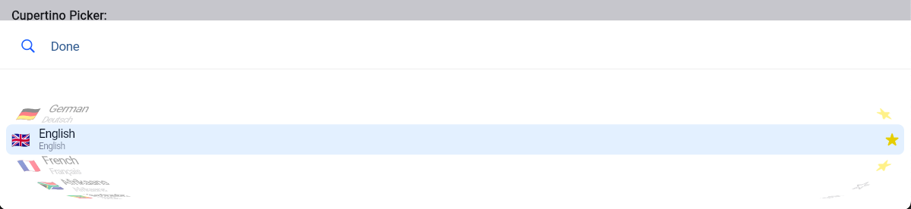

# Custom Language Picker

A highly customizable language picker for Flutter applications with search functionality, favorites support, and multiple UI styles including dropdown, dialog, and Cupertino pickers.

  

## Features

- 🌎 Support for 60+ languages with native names and flag emojis
- 🔍 Powerful search functionality
- ⭐ Favorites system to quickly access preferred languages
- 🎨 Three UI variants:
    - Material Design dropdown
    - Material Design dialog
    - Cupertino style picker
- 🎭 Fully customizable appearance
- 🔄 Simple callback system for language selection
- 📱 Responsive design for different screen sizes

  
  
  

## Getting Started

Add the package to your `pubspec.yaml`:

dependencies:
  custom_language_picker: ^0.1.0
  
  
  
Then import it in your Dart code:
import 'package:custom_language_picker/custom_language_picker.dart';

Additional Information

Supported languages: check the Languages.defaultLanguages list for all supported languages
Contributions are welcome! Please feel free to submit a Pull Request
Report issues or suggest features on the GitHub repository

License
This package is available under the MIT License.
